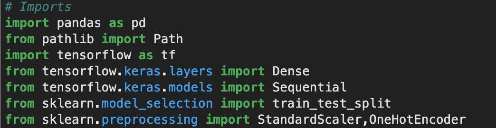
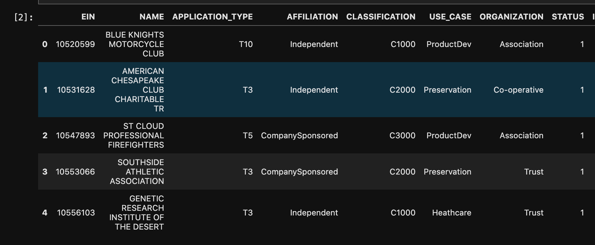
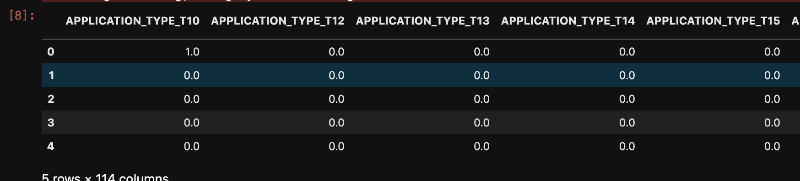
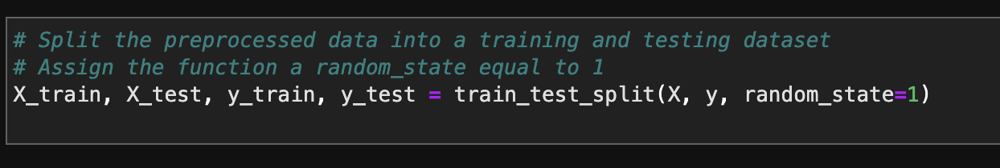
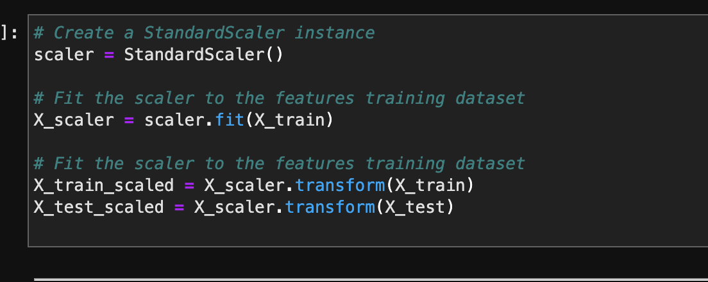
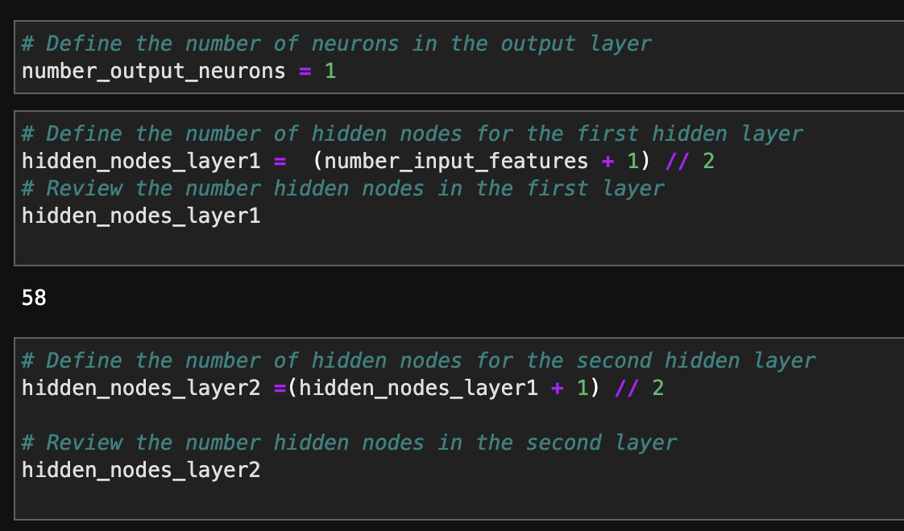
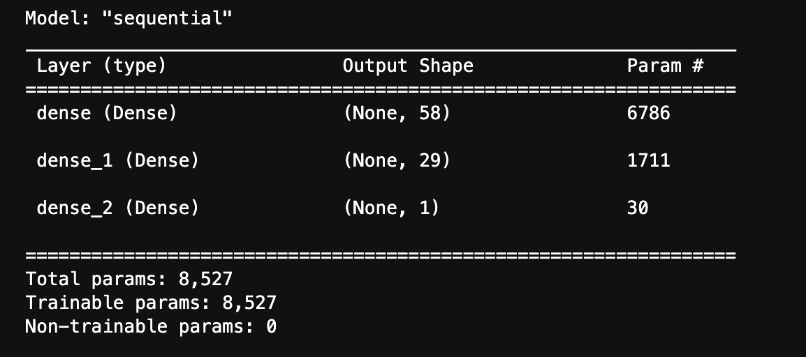
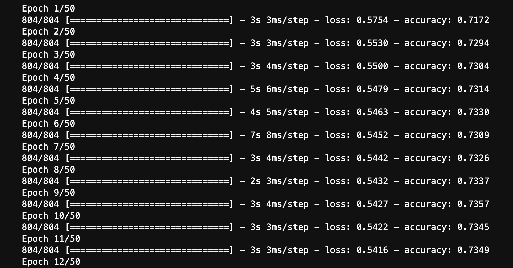
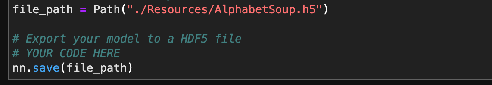

# Week-13-Neural-Network-To-Estimate-Startup-success-

---

Neural network endeavors to emulate the human neuro system to make decision. It is one of the sub-divisions of Machine Learning's supervized learning system, where the algorithm has datas are passed from different nodes for input, which is derived from the avaiable fetaures, hidden layers, and output layer to give an estimation.

In this application, we have used tothe neural network to estimate if a startup funded by Alphabet Soup, a venture capital firm, would be able to successful

---
## Technology used:

The program was written on JupyterLab using Python script.

The program uses multiple libraries like Pandas for data manipulation, Tensorflow for machine learning, as well as other machine learning tools like Scikit-Learn. Other tools like Keras under Tensorflow was also used. 

Intsallation of Tensorflow and Keras are essential for the program to work. Using intsallation manager we can install these libraries.

The commands are given below:
* pip install tensorflow
* pip install keras

---
## Installation:

The following commands were used to call upon libraries, and the commands associated with them are given as follows:

---
## Application:

The program firstly cleans and preps the data and creates different dataframes to store the features that we will be using, and the target. We also remove data that are redundant.

We can use OneHotEncoder to transform/encode our catagorical data to values suitable for our calculations.

The features and target datasets need to be set.

StandardScaler can be used to transform the data into a normal distribution model so that the data is suitable for estimations.

We create multiple neural networks with number of inputs equal to the number of features, numerous hidden layers,and output layer. The program has multiple of such neural network models with different numbers of hidden layers so that we can conduct a trail and error on finding the optimal model.

We fit the data into the model and make prediction.

We can check the measure the efficiency of the model. 

The program also allows us to save the model.

---

Babin Shrestha